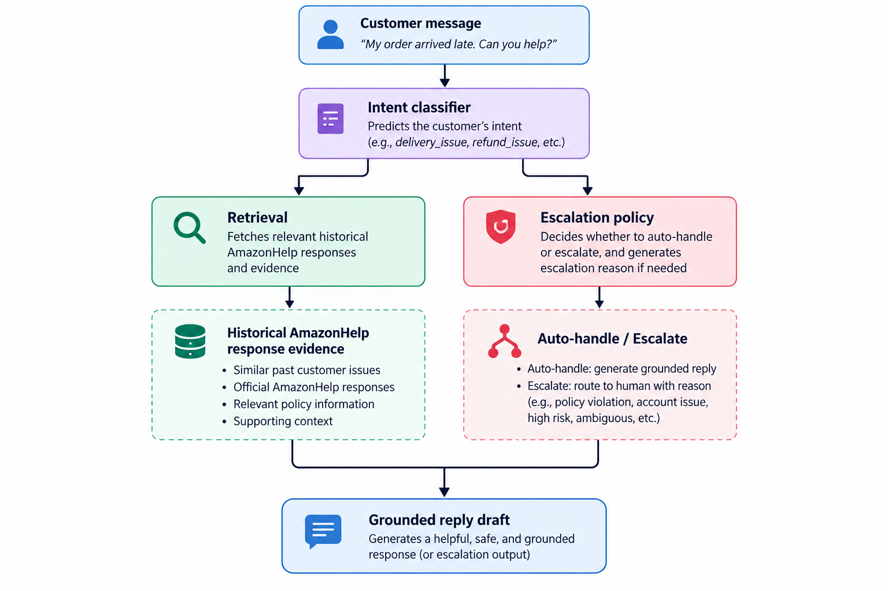

# Hiver Assignment

## AI Customer Support Agent for AmazonHelp

### 1. Problem Framing

I built an AI support agent for **AmazonHelp** using the Kaggle Customer Support on Twitter dataset.

The agent performs three tasks:

1. **Intent classification** — classify an incoming customer message into a compact taxonomy of recurring support issues.

2. **Reply drafting** — retrieve historically similar AmazonHelp conversations and use the historical response as grounded evidence for a draft reply.

3. **Handle vs escalate** — decide whether the issue can be safely auto-handled or should be escalated, with an explicit reason.

The key design principle was **conservatism**: the system should avoid confidently answering when historical evidence is weak, retrieval is ambiguous, or the issue involves sensitive account/financial actions.

---

## 2. Data and Thread Reconstruction

The source dataset contains approximately 3M customer-support tweets with fields including tweet ID, author ID, inbound/outbound direction, timestamps, text, and reply relationships.

I selected **AmazonHelp** as the brand.

Rather than searching for `@AmazonHelp` inside tweet text, I filtered on the dataset's `author_id` field. This produced:

* **169,840 AmazonHelp tweets**

* All selected AmazonHelp tweets were outbound (`inbound=False`)

* **0 duplicate tweet IDs**

* **324,881 relevant tweets** after adding customer messages needed for conversation reconstruction

* **86,658 reconstructed conversation threads**

* **324,787 messages** in the final thread set

* Average thread length: **3.75 messages**

* **41,429 threads** contain multiple AmazonHelp responses

Threads were reconstructed using `response_tweet_id` and `in_response_to_tweet_id`, followed by chronological ordering and validation. Validation found **0 chronological ordering errors** and no empty threads lacking the required customer/AmazonHelp messages.

This reconstruction was important because individual tweets often lack enough context to determine the customer's actual issue or how AmazonHelp resolved it.

---

## 3. Intent Taxonomy

I first used unsupervised clustering to discover recurring issue patterns, then manually consolidated noisy clusters into a compact support taxonomy.

The final taxonomy contains 10 business intents plus `other`:

| Intent                     | Description                                                    |
| -------------------------- | -------------------------------------------------------------- |
| `delivery_issue`           | Delivered/late/missing delivery problems                       |
| `order_issue`              | Problems with an existing order                                |
| `shipping_issue`           | Shipping availability, destination, or shipping questions      |
| `payment_issue`            | Payment method/payment processing issues                       |
| `refund_issue`             | Refund or money-return issues                                  |
| `account_issue`            | Account access, closure, or account-related issues             |
| `prime_video_issue`        | Prime Video playback/subscription/content issues               |
| `device_issue`             | Kindle/Fire/Amazon device issues                               |
| `product_or_content_issue` | Product, media, or content-specific questions                  |
| `support_complaint`        | Complaints about support/service experience                    |
| `other`                    | Messages that cannot be reliably assigned to a business intent |

The `other` class is deliberate. Many tweets are extremely short, noisy, or lack sufficient context, so forcing every message into a specific business category would create misleading labels.

---

## 4. System Design

The pipeline has four major components:



### Intent classification

The production classifier is a TF-IDF + Logistic Regression model trained on weak labels generated from recurring patterns in the historical data.

The model is intentionally lightweight so the complete project can run locally without a large model dependency.

### Historical retrieval

I built a TF-IDF retrieval index over reconstructed AmazonHelp conversations.

The index contains:

* **86,658 threads**

* **86,220 searchable documents**

* 30,000-token TF-IDF vocabulary

Retrieval returns the most similar historical customer-support conversation and its AmazonHelp response.

### Reply generation

The current implementation uses the highest-confidence historical AmazonHelp response as the primary grounded draft rather than generating unsupported new facts.

If retrieval confidence is below the configured threshold, the agent falls back to a conservative response rather than pretending that it has strong historical evidence.

### Escalation

Escalation rules consider:

* retrieval confidence

* retrieval score gap/ambiguity

* intent confidence

* sensitive account actions

* payment/refund issues

* support complaints

* insufficient information

* complex issues

Explicit high-risk categories such as account, payment, refund, and support complaints take precedence over generic low-confidence rules.

---

# 5. Evaluation

The evaluation set contains **200 manually labelled examples** sampled from reconstructed AmazonHelp threads.

Sampling used heuristic signals only to improve coverage across issue types and difficulty; the final intent/action/escalation labels were manually assigned.

Final golden-set distribution:

| Intent                   |   Count |
| ------------------------ | ------: |
| delivery_issue           |      36 |
| other                    |      31 |
| product_or_content_issue |      27 |
| order_issue              |      21 |
| account_issue            |      17 |
| shipping_issue           |      13 |
| refund_issue             |      12 |
| payment_issue            |      12 |
| prime_video_issue        |      11 |
| support_complaint        |      10 |
| device_issue             |      10 |
| **Total**                | **200** |

Actions:

* **141 escalate**

* **59 auto-handle**

This distribution is intentionally not balanced and reflects the sampled evaluation set.

### Baselines

| Model                        |  Accuracy |   Macro F1 | Weighted F1 |
| ---------------------------- | --------: | ---------: | ----------: |
| Majority baseline            |     18.0% |     0.0277 |      0.0549 |
| TF-IDF + Logistic Regression |     35.0% |     0.3449 |      0.3359 |
| Full agent                   | **44.0%** | **0.4544** |  **0.4281** |

The full agent therefore improves intent classification over both simple baselines, although the absolute accuracy remains far from production-ready.

### Agent-level metrics

| Metric                |     Result |
| --------------------- | ---------: |
| Intent accuracy       |  **44.0%** |
| Intent macro F1       | **0.4544** |
| Intent weighted F1    | **0.4281** |
| Action accuracy       |  **65.5%** |
| Auto-handle precision |  **22.2%** |
| Escalation recall     |  **90.1%** |
| Grounded reply rate   |  **72.0%** |
| Retrieval available   |   **100%** |

The action results show an important trade-off: the system has high escalation recall but low auto-handle precision. This is consistent with the conservative design goal, but it also means the current system escalates too many cases.

---

# 6. LLM-as-Judge Evaluation

I additionally evaluated generated replies using an LLM judge on a selected subset of examples.

The judge evaluated:

* relevance

* groundedness

* helpfulness

* safety

* overall quality

The evaluation used `openai/gpt-oss-120b` through Groq.

The provider quota was reached during evaluation, so only **32 examples completed successfully** rather than the intended larger sample.

Results from the completed evaluations:

| Dimension    |     Mean |
| ------------ | -------: |
| Relevance    | 2.72 / 5 |
| Groundedness | 3.06 / 5 |
| Helpfulness  | 2.28 / 5 |
| Safety       | 4.97 / 5 |
| Overall      | 2.66 / 5 |

This result is intentionally reported as **quota-limited**, not as a full 200-example LLM evaluation.

The strongest signal is safety: the conservative escalation strategy generally avoids unsafe responses. Helpfulness and relevance are substantially weaker because historical retrieval can return a superficially similar but operationally incorrect response.

---

# 7. Human Agreement

A second annotation set of **40 examples** was created to measure annotation consistency.

Results:

| Dimension         | Raw Agreement |  Cohen's κ |
| ----------------- | ------------: | ---------: |
| Intent            |     **67.5%** | **0.6315** |
| Action            |     **92.5%** | **0.7931** |
| Escalation reason |      **2.5%** |          — |

Intent and action agreement are substantially stronger than escalation-reason agreement.

The very low escalation-reason agreement indicates that the reason taxonomy is currently more subjective than the primary intent/action labels. This is a useful limitation rather than something to hide: the next iteration should make escalation-reason definitions more mutually exclusive and provide clearer annotation examples.

---

# 8. Top 5 Failure Modes

## 1. Operational words overpower the real intent

**Example — `golden_0002`**

The customer complains about a support experience while mentioning a paid shoe rack/order. The gold label is `support_complaint`, but the classifier predicts `delivery_issue`.

**Hypothesis:** the classifier overweights words such as "paid", "delivery", and product/order terminology while underweighting the customer's actual complaint about support.

**Fix:** add more complaint examples and hierarchical classification separating "what happened" from "how the customer feels about support".

---

## 2. High retrieval score does not guarantee useful evidence

**Example — `golden_0010`**

The customer asks whether a Pokémon game can be delivered to the Philippines. The correct intent is `shipping_issue`, but the classifier predicts `other`.

Retrieval returns a very high-scoring result, yet the resulting response is not useful for the actual question.

**Hypothesis:** TF-IDF similarity is lexical rather than semantic. Shared words can produce a high score even when the operational intent differs.

**Fix:** replace or augment TF-IDF retrieval with dense embeddings and apply intent-aware retrieval filtering.

---

## 3. Identical lexical scores can hide ambiguity

**Example — `golden_0028`**

The message is essentially "help, Amazon". The top two retrieval scores are both **1.0**, producing a score gap of **0**.

The system therefore has no reliable basis for choosing between the retrieved responses.

**Hypothesis:** very short messages contain insufficient information for lexical retrieval.

**Fix:** explicitly detect very short/low-information queries and escalate instead of retrieving arbitrary evidence.

---

## 4. Conservative escalation causes too many escalations

The system achieves **90.1% escalation recall**, but auto-handle precision is only **22.2%**.

**Hypothesis:** safety rules are effective at catching risky cases but are too broad for routine customer questions.

**Fix:** calibrate the escalation threshold on a larger labelled set and distinguish "uncertain" from "actually risky".

---

## 5. Historical responses can be grounded but not helpful

The grounded reply rate is **72.0%**, while LLM-judge helpfulness is only **2.05/5** on the quota-limited sample.

This demonstrates that simply retrieving a historical AmazonHelp response is not sufficient.

**Hypothesis:** historical replies may be appropriate for their original context but incomplete or awkward when reused for a new customer message.

**Fix:** retrieve multiple candidates, verify that the candidate matches the predicted intent, then use an LLM to synthesize a concise response strictly from the retrieved evidence.

---

# 9. What Is Misleading About My Headline Number?

The most tempting headline is:

> **"The agent achieves 44% intent accuracy."**

That number is useful, but misleading if interpreted as production performance.

First, the evaluation set contains only **200 manually labelled examples**, so it is a small sample relative to the original dataset.

Second, the agent's classifier is trained using weak labels derived from historical data, while the evaluation labels are manually assigned. Therefore the task includes label-boundary ambiguity.

Third, the taxonomy contains an intentionally broad `other` class. Some messages are inherently difficult to classify from a single tweet.

ourth, the 40-example Annotation Consistency Check provides a useful diagnostic of taxonomy consistency, but it was not an independently blinded human annotation study. The second-pass labels were prepared using model-assisted suggestions, so the observed **67.5%** raw intent agreement and 0.6315 Cohen's kappa should not be interpreted as genuine inter-annotator agreement.

Finally, reply quality is not captured by intent accuracy. A system can correctly identify an intent while retrieving an unhelpful response.

Therefore, **44% should be treated as an honest baseline for this prototype, not as evidence that the system is ready for autonomous production support.**

The more meaningful result is the combination of:

* improvement over the majority and simple ML baselines,

* relatively strong human agreement on action decisions,

* high escalation recall,

* conservative safety behaviour,

* and clearly identified retrieval/classification failure modes.

---

# 10. Non-Obvious Design Decisions

The following decisions were deliberately made during implementation:

1. Filter AmazonHelp using `author_id`, not only mentions in tweet text.

2. Reconstruct conversation threads before defining intents.

3. Use the first customer message as the primary intent signal.

4. Keep `other` instead of forcing ambiguous tweets into business categories.

5. Use unsupervised clustering only for taxonomy discovery, not as the final ground truth.

6. Keep the golden set separate from weak-label training.

7. Use historical AmazonHelp responses as retrieval evidence.

8. Add a minimum retrieval-confidence threshold.

9. Treat retrieval score gaps as an ambiguity signal.

10. Make account/payment/refund/support cases conservative by default.

11. Test escalation-rule precedence explicitly.

12. Report auto-handle precision separately from escalation recall.

13. Add human agreement rather than relying only on model metrics.

14. Report the LLM-judge quota limitation instead of presenting an incomplete sample as a full evaluation.

15. Keep failure examples tied to real golden-set records rather than synthetic examples.

---

# 11. Next-Week Plan

### P0 — Improve evaluation quality

* Expand the golden set beyond 200 examples.

* Obtain a genuinely independent second annotator.

* Rewrite escalation-reason guidelines because agreement is currently only 2.5%.

* Add confidence intervals to headline metrics.

### P1 — Improve retrieval

* Replace TF-IDF-only retrieval with dense embeddings.

* Retrieve top-k candidates instead of a single response.

* Filter candidates using predicted intent.

* Add an explicit "no trustworthy evidence" state.

### P1 — Improve classification

* Replace weak keyword labels with more carefully curated training labels.

* Investigate hierarchical classification:

* broad issue family

* specific intent

* Calibrate classifier confidence on held-out manually labelled data.

### P2 — Improve reply generation

* Use an LLM to synthesize responses from retrieved historical evidence.

* Require the generated response to remain grounded in retrieved evidence.

* Add automated checks for unsupported claims.

* Evaluate reply quality separately from intent accuracy.

### P2 — Improve production safety

* Add stricter handling for account, payment, refund, and identity-sensitive actions.

* Prefer escalation when evidence is ambiguous.

* Log intent confidence, retrieval score, retrieval gap, and escalation reason for every decision.

---

# 12. Reproducibility

The repository contains scripts for:

```text

data preparation

thread reconstruction

intent discovery

golden-set creation

golden-set validation

intent classification

retrieval indexing

agent execution

automated evaluation

LLM-as-judge evaluation

human agreement

```

The main evaluation artifacts are stored under:

```text

results/

├── metrics.json

├── examples.json

├── failure_analysis.md

├── evaluation_examples.jsonl

├── llm_judge_results.jsonl

├── llm_judge_metrics.json

└── human_agreement.json

```

The intended workflow is:

```bash

python -m scripts.prepare_data

python -m scripts.create_golden_set

python -m scripts.label_golden_set

python -m scripts.verify_golden_set

python -m scripts.run_agent

python -m scripts.evaluate

python -m scripts.verify_second_annotation

python -m src.evaluation.human_agreement

```

The final prototype prioritizes **reproducibility, groundedness, conservative escalation, and honest evaluation** over presenting an artificially high headline metric.

# Hiver Customer Support Agent

An AI-assisted customer support agent built for the Hiver SDE Intern take-home assignment using the **Customer Support on Twitter (TWCS)** dataset.

The system focuses on **Amazon Help (`amazonhelp`)** and performs three core tasks:

1. **Intent classification** — classify an incoming customer message into a compact support taxonomy.

2. **Grounded reply drafting** — retrieve historically similar Amazon Help conversations and use their historical responses as evidence for a draft reply.

3. **Auto-handle vs. escalation** — decide whether a message can be handled automatically or should be escalated, with an explicit reason.

The project is designed around four principles:

* **Historical grounding** instead of unsupported free-form answers.

* **Conservative automation** for potentially risky support cases.

* **Evaluation separation** between training data and the golden evaluation set.

* **Transparent reporting** of limitations, failure modes, and evaluation constraints.

---

# 1. Problem Framing

Customer-support systems need to do more than classify messages.

For an incoming customer message, a useful support agent should answer three questions:

```text

What is the customer asking about?

    ↓
How has this brand historically handled similar cases?

    ↓
Is this safe to handle automatically, or should a human take over?

```

This project therefore treats the problem as a pipeline:

```text

Customer message

  │

  ▼
Intent classification

  │

  ├──────────────────────┐

  ▼                      ▼
Historical retrieval Risk / escalation policy

  │                      │

  ▼                      ▼
Grounded reply Auto-handle / Escalate

  │                      │

  └──────────┬───────────┘

             ▼

       Final agent output
```

The goal is not to claim that the resulting system is production-ready. Instead, the project evaluates whether a relatively lightweight system can provide useful intent predictions, historically grounded responses, and conservative escalation decisions.

---

# 2. Dataset

The project uses Kaggle's **Customer Support on Twitter (TWCS)** dataset.

The raw dataset contains millions of customer-support tweets and includes fields such as:

```text

tweet_id

author_id

inbound

created_at

text

response_tweet_id

in_response_to_tweet_id

```

The raw dataset is intentionally **not committed to this repository** because of its size and dataset/licensing considerations.

Expected location:

```text

data/raw/twcs.csv

```

## Target brand

I selected **Amazon Help (`amazonhelp`)** as the target support account.

Amazon Help tweets were identified using:

```text

author_id == "amazonhelp"

```

rather than searching for `@AmazonHelp` inside tweet text.

This avoids missing support responses where the account name is not explicitly mentioned in the tweet body.

---

# 3. Data Processing

The original dataset is tweet-level data, while the support-agent problem is conversation-level.

Therefore, the first major preprocessing step is **thread reconstruction**.

The pipeline:

```text

TWCS raw tweets

  │

  ▼
Extract AmazonHelp responses

  │

  ▼
Find customer tweets connected to responses

  │

  ▼
Follow response relationships

  │

  ▼
Reconstruct chronological threads

  │

  ▼
Validate reconstructed conversations

```

The resulting Amazon Help subset contains approximately:

* **169,840 AmazonHelp tweets**

* **86,658 reconstructed support threads**

* **324,787 total messages**

* approximately **3.75 messages per thread**

All reconstructed threads were validated for:

* non-empty messages

* valid tweet IDs

* chronological ordering

* customer/AmazonHelp message presence

* valid parent-child relationships

The project also includes individual data inspection and validation scripts used during development.

---

# 4. Repository Structure

```text

Hiver-project/
│
├── .gitignore
├── DECISION_LOG.md
├── README.md
├── data
│   ├── golden
│   │   ├── annotation_guidelines.md
│   │   ├── golden_set.json
│   │   ├── golden_set.jsonl
│   │   ├── golden_set_backup.jsonl
│   │   ├── second_annotation.jsonl
│   │   ├── second_annotation_backup.jsonl
│   │   └── second_annotation_guidelines.md
│   ├── processed
│   │   ├── amazon_help_context.csv
│   │   ├── amazon_help_threads.jsonl
│   │   ├── amazon_help_tweets.csv
│   │   ├── amazonhelp_intent_clusters.csv
│   │   ├── intent_classifier.pkl
│   │   └── retrieval_index.pkl
│   └── raw
│       └── twcs.csv
├── pyproject.toml
├── report
│   └── report.md
├── requirements.txt
├── results
│   ├── evaluation_examples.jsonl
│   ├── failure_analysis.jsonl
│   ├── failure_analysis.md
│   ├── human_agreement.json
│   ├── llm_judge_metrics.json
│   ├── llm_judge_results.jsonl
│   └── metrics.json
├── scripts
│   ├── __init__.py
│   ├── _bootstrap.py
│   ├── auto_label_golden_set.py
│   ├── create_golden_set.py
│   ├── create_second_annotation_set.py
│   ├── data
│   │   ├── 03_extract_amazonhelp.py
│   │   ├── 04_build_conversations.py
│   │   ├── 04_extract_amazonhelp_context_v2.py
│   │   ├── 04_validate_context.py
│   │   ├── 05_reconstruct_conversations.py
│   │   └── 06_validate_data.py
│   ├── evaluate.py
│   ├── exploration
│   │   ├── 01_inspect_data.py
│   │   └── 02_find_amazonhelp.py
│   ├── label_golden_set.py
│   ├── prepare_data.py
│   ├── reset_golden_labels.py
│   ├── run_agent.py
│   ├── verify_golden_set.py
│   └── verify_second_annotation.py
├── src
│   ├── __init__.py
│   ├── agent
│   │   ├── __init__.py
│   │   ├── escalation.py
│   │   ├── generate_reply.py
│   │   └── pipeline.py
│   ├── data
│   │   ├── __init__.py
│   │   ├── build_threads.py
│   │   ├── clean.py
│   │   └── load_data.py
│   ├── evaluation
│   │   ├── __init__.py
│   │   ├── agent_eval.py
│   │   ├── baselines.py
│   │   ├── failures.py
│   │   ├── golden_set.py
│   │   ├── human_agreement.py
│   │   ├── llm_judge.py
│   │   ├── reply_judge.py
│   │   ├── reporting.py
│   │   └── runner.py
│   ├── intent
│   │   ├── __init__.py
│   │   ├── classifier.py
│   │   ├── discover.py
│   │   └── schemas.py
│   └── retrieval
│       ├── __init__.py
│       ├── index.py
│       └── retrieve.py
└── tests
    ├── test_agent_rules.py
    ├── test_human_agreement.py
    └── test_llm_judge_cache.py
```

The numbered root-level scripts are retained because they document the data inspection and reconstruction process.

Generated datasets, model artifacts, the raw TWCS dataset, and local environment files are excluded through `.gitignore`.

---

# 5. Environment Setup

The project uses Python.

## Create virtual environment

On macOS/Linux:

```bash

python3 -m venv venv

```

Activate it:

```bash

source venv/bin/activate

```

Install dependencies:

```bash

pip install -r requirements.txt

```

Verify Python:

```bash

python --version

```

---

# 6. Dataset Setup

Download the Customer Support on Twitter dataset from Kaggle.

Place the downloaded CSV at:

```text

data/raw/twcs.csv

```

The repository expects:

```text

data/raw/twcs.csv

```

The raw dataset is ignored by Git and should remain local.

---

# 7. Data Preparation

The main preparation entry point is:

```bash

python -m scripts.prepare_data

```

The preparation process performs the required extraction and reconstruction steps.

The project also contains lower-level scripts:

```bash

python 01_inspect_data.py

python 02_find_amazonhelp.py

python 03_extract_amazonhelp.py

python 04_build_conversations.py

python 04_extract_amazonhelp_context_v2.py

python 04_validate_context.py

python 05_reconstruct_conversations.py

python 06_validate_data.py

```

These scripts were used to inspect the raw dataset, identify Amazon Help, build customer context, reconstruct threads, and validate the resulting data.

Generated artifacts are written under:

```text

data/processed/

```

and are intentionally not committed.

---

# 8. Intent Discovery

The intent taxonomy was not chosen arbitrarily.

The process was:

```text

Reconstructed customer-support threads

        │

        ▼
First customer message

        │

        ▼
Text cleaning

        │

        ▼
TF-IDF representation

        │

        ▼
K-Means clustering

        │

        ▼
Manual inspection/consolidation

        │

        ▼
Final support taxonomy

```

The initial clustering configuration used:

```text

TF-IDF max_features = 20,000

ngram_range = (1, 2)

min_df = 5

max_df = 0.90

sublinear_tf = True

K-Means:

n_clusters = 15

random_state = 42

n_init = 10

```

The clusters were then manually consolidated into a smaller business-oriented taxonomy.

This approach was useful because raw tweet clusters contain substantial lexical noise and overlapping themes.

---

# 9. Final Intent Taxonomy

The final taxonomy contains **10 business intents plus `other`**.

| Intent                     | Description                                                                                     |
| -------------------------- | ----------------------------------------------------------------------------------------------- |
| `delivery_issue`           | Problems with delivery, delivery status, delayed delivery, or delivered-but-not-received cases. |
| `order_issue`              | Problems concerning an order that are not primarily about shipping/delivery.                    |
| `shipping_issue`           | Shipping availability, destinations, shipping options, or related shipping questions.           |
| `payment_issue`            | Payment, charging, billing, or payment-method problems.                                         |
| `refund_issue`             | Refund requests, refund status, or refund-related problems.                                     |
| `account_issue`            | Account access, account state, account closure, or account-related actions.                     |
| `prime_video_issue`        | Prime Video playback, subscription, or Prime Video-specific problems.                           |
| `device_issue`             | Amazon/device-related hardware or device functionality problems.                                |
| `product_or_content_issue` | Product, media, content, or product-specific questions/problems.                                |
| `support_complaint`        | Complaints about the support/service experience requiring human attention.                      |
| `other`                    | Messages that cannot be confidently mapped to a business intent.                                |

The `other` class is deliberate.

Very short, noisy, ambiguous, or unusual messages should not be forced into an incorrect business category.

---

# 10. Intent Classification

The production classifier is implemented in:

```text

src/intent/classifier.py

```

The classifier is trained using historical/weakly derived labels rather than the 200-example golden evaluation set.

This separation is intentional:

```text

Training data

  │

  ▼
Production classifier

Golden set

  │

  ▼
Evaluation only

```

The golden set is therefore not used to train or tune the production classifier.

This reduces the risk of reporting an evaluation score that is directly optimized on the evaluation examples.

---

# 11. Historical Response Retrieval

The second major component is historical retrieval.

Instead of asking a language model to invent a response from scratch, the system retrieves historically similar Amazon Help conversations and uses their responses as evidence.

The retrieval pipeline is:

```text

Incoming customer message

      │

      ▼
Text normalization

      │

      ▼
TF-IDF similarity search

      │

      ▼
Top historical examples

      │

      ▼
Historical AmazonHelp response

```

The retrieval index contains approximately:

* **86,658 reconstructed threads**

* **86,220 usable retrieval documents**

* **30,000-feature TF-IDF vocabulary**

The implementation is in:

```text

src/retrieval/index.py

src/retrieval/retrieve.py

```

---

# 12. Why Historical Grounding?

Customer support is particularly sensitive to unsupported answers.

A generic language model may generate plausible-sounding instructions that are not supported by the brand's actual historical behavior.

The project therefore uses historical Amazon Help responses as evidence.

The desired behavior is:

```text

Similar historical issue

    ↓
Historical AmazonHelp response

    ↓
Grounded draft

```

rather than:

```text

Customer message

    ↓
Unconstrained generated answer

```

If retrieval confidence is insufficient, the system uses a conservative fallback rather than presenting a weak historical match as reliable evidence.

---

# 13. Reply Generation

The reply-generation component is implemented in:

```text

src/agent/generate_reply.py

```

The current implementation selects the strongest relevant historical Amazon Help response when retrieval evidence passes the configured threshold.

The system also cleans common Twitter artifacts such as:

* URLs

* mentions

* noisy text patterns

The generation policy has a minimum evidence threshold.

If no sufficiently strong evidence is available, the agent avoids pretending that it has a reliable answer.

This is intentionally conservative.

---

# 14. Auto-Handle vs. Escalation

The final component decides whether a case should be:

```text

auto_handle

```

or:

```text

escalate

```

The escalation policy is implemented in:

```text

src/agent/escalation.py

```

The policy considers:

* retrieval confidence

* retrieval score gap

* intent confidence

* intent ambiguity

* sensitive account actions

* financial/payment/refund issues

* support complaints

* insufficient information

* complex cases

* unusual/non-English input

Possible escalation reasons include:

```text

low_retrieval_confidence

ambiguous_retrieval

unknown_intent

sensitive_account_action

refund_or_financial_action

support_complaint

insufficient_information

complex_issue

low_intent_confidence

conflicting_candidate_intents

non_english_or_special_chars

```

---

# 15. Conservative Risk Policy

Some categories are deliberately biased toward escalation.

In particular:

* account actions

* payment/financial issues

* refund requests

* explicit support complaints

receive stronger escalation treatment.

This is because an incorrect automated answer can be substantially more harmful for these cases than for a simple informational request.

Rule precedence was explicitly designed so that high-risk categories cannot be overridden merely because a generic operational classifier has high confidence.

---

# 16. Running the Agent

After preparing the data and generating the required processed artifacts:

```bash

python -m scripts.run_agent

```

The main pipeline is:

```text

src/agent/pipeline.py

```

The output contains information such as:

```text

Intent

Intent confidence

Retrieved evidence

Retrieval score

Draft reply

Action

Escalation reason

```

Conceptually:

```text

Intent: delivery_issue

Confidence: 0.99

Action: auto_handle

Evidence:

<similar historical AmazonHelp conversation>

Reply:

<historically grounded response>

```

For a sensitive case:

```text

Intent: account_issue

Confidence: 0.99

Action: escalate

Reason:

sensitive_account_action

```

---

# 17. Golden Evaluation Set

The project uses a **200-example golden evaluation set**.

Each example contains:

```text

example_id

customer_message

thread_context

historical_amazonhelp_response

gold_intent

gold_action

gold_escalation_reason

annotator_notes

sampling_metadata

```

The set is stored at:

```text

data/golden/golden_set.jsonl

```

The annotation guidelines are stored at:

```text

data/golden/annotation_guidelines.md

```

---

# 18. Golden Set Sampling

The golden set was created from reconstructed Amazon Help threads.

Sampling used deterministic keyword-assisted stratification to improve coverage across recurring issue categories.

Important distinction:

> Keyword heuristics were used to select diverse examples, not to define the final ground-truth labels.

The final labels were manually assigned.

The evaluation set intentionally contains difficult and ambiguous examples rather than selecting only easy classification cases.

---

# 19. Golden Set Distribution

The final 200 examples are distributed as follows:

| Intent                     | Examples |
| -------------------------- | -------: |
| `delivery_issue`           |       36 |
| `other`                    |       31 |
| `product_or_content_issue` |       27 |
| `order_issue`              |       21 |
| `account_issue`            |       17 |
| `shipping_issue`           |       13 |
| `refund_issue`             |       12 |
| `payment_issue`            |       12 |
| `prime_video_issue`        |       11 |
| `support_complaint`        |       10 |
| `device_issue`             |       10 |
| **Total**                  |  **200** |

Action labels:

| Action        | Examples |
| ------------- | -------: |
| `escalate`    |      141 |
| `auto_handle` |       59 |
| **Total**     |  **200** |

---

# 20. Golden Set Validation

The golden set can be validated using:

```bash

python -m scripts.verify_golden_set

```

The validation checks:

* total number of examples

* label completeness

* valid intent values

* valid action values

* required fields

Current result:

```text

200 examples

200 labeled

100% label coverage

0 invalid intents

0 invalid actions

```

---

# 21. Baseline 1 — Majority Classifier

The first baseline is intentionally trivial.

It always predicts the majority intent.

Results on the 200-example golden set:

| Metric      |      Score |
| ----------- | ---------: |
| Accuracy    | **18.00%** |
| Macro F1    | **0.0277** |
| Weighted F1 | **0.0549** |

This baseline demonstrates the impact of class imbalance.

A model can obtain a seemingly reasonable accuracy by favoring frequent classes while performing poorly on minority intents.

---

# 22. Baseline 2 — TF-IDF + Logistic Regression

The second baseline is a simple supervised text classifier.

Pipeline:

```text

Customer message

  ↓
TF-IDF

  ↓
Logistic Regression

  ↓
Intent

```

Results:

| Metric      |      Score |
| ----------- | ---------: |
| Accuracy    | **35.00%** |
| Macro F1    | **0.3449** |
| Weighted F1 | **0.3359** |

This provides a stronger reference point than the trivial majority baseline.

---

# 23. Agent Evaluation Results

The complete agent was evaluated on the 200-example golden set.

Current headline results:

| Metric                |     Result |
| --------------------- | ---------: |
| Intent accuracy       |  **44.0%** |
| Intent macro F1       | **0.4544** |
| Intent weighted F1    | **0.4281** |
| Action accuracy       |  **65.5%** |
| Auto-handle precision |  **22.2%** |
| Escalation recall     |  **90.1%** |
| Grounded reply rate   |  **72.0%** |
| Retrieval available   |   **100%** |

The results are stored in:

```text

results/llm_judge_results.jsonl

results/llm_judge_metrics.json

```

---

# 24. Interpreting the Results

The 44% intent accuracy is an improvement over:

```text

Majority baseline: 18.0%

TF-IDF + Logistic Regression: 35.0%

Agent: 44.0%

```

However, this should not be interpreted as production readiness.

The system currently has:

* strong escalation recall

* relatively weak auto-handle precision

* imperfect intent classification

* imperfect lexical retrieval

* substantial failure cases

Therefore, the most defensible characterization is:

> The current system is more suitable as a **conservative support-assistance and escalation system** than as an unrestricted autonomous customer-support agent.

---

# 25. Auto-Handle vs. Escalation Results

Action accuracy is:

```text

65.5%

```

However, accuracy alone is not sufficient because the costs of the two errors are different.

The more important safety-oriented metrics are:

```text

Auto-handle precision: 22.2%

Escalation recall: 90.07%

```

The high escalation recall indicates that the system catches most cases that should be escalated.

The low auto-handle precision indicates that the system currently **auto-handles too many cases incorrectly**.

This is an important production limitation.

A future version should therefore optimize the decision threshold to improve auto-handle precision while maintaining high escalation recall.

---

# 26. Grounded Reply Evaluation

The current grounded reply rate is:

```text

72.0%

```

This metric measures whether the generated/selected reply has usable historical evidence behind it.

Retrieval availability is:

```text

100%

```

However:

> Retrieval availability does not imply retrieval correctness.

A query can always return a document while still retrieving the wrong historical issue.

Therefore, retrieval score and retrieval availability are treated as separate concepts.

---

# 27. LLM-as-Judge Evaluation

A subset of generated replies was evaluated using an LLM judge.

The judge considered:

* relevance

* groundedness

* helpfulness

* safety

* overall quality

The LLM-judge evaluation was affected by the available Groq API quota.

The current run contains:

```text

19 successfully judged examples

```

The API began returning rate-limit errors after approximately the first 20 calls because of the available:

```text

200,000 tokens/day

```

quota.

Therefore, the LLM-judge metrics are **not treated as a full 200-example estimate**.

Current results:

| Dimension    |        Score |
| ------------ | -----------: |
| Relevance    | **2.72 / 5** |
| Groundedness | **3.06 / 5** |
| Helpfulness  | **2.28 / 5** |
| Safety       | **4.97 / 5** |
| Overall      | **2.66 / 5** |

Additional judge statistics:

```text

Overall >= 4: 26.32%

Groundedness >= 4: 42.11%

Helpfulness >= 4: 15.79%

```

Results are stored in:

```text

results/llm_judge_results.jsonl

results/llm_judge_metrics.json

```

The quota limitation is explicitly reported rather than hidden.

---

# 28. Annotation Consistency Check

The project contains a second-pass annotation set:

```text

data/golden/second_annotation.jsonl

```

However, there is an important methodological limitation.

The second-pass labels were prepared using **model-assisted suggestions rather than being independently produced by a separate blinded human annotator**.

Therefore, these results **must not be described as genuine independent human inter-annotator agreement**.

A second-pass consistency check is therefore not available for the latest evaluation.

Current consistency results:

| Dimension                       |     Result |
| ------------------------------- | ---------: |
| Intent raw agreement            |  **67.5%** |
| Intent Cohen's kappa            | **0.6315** |
| Action raw agreement            |  **92.5%** |
| Action Cohen's kappa            | **0.7931** |
| Escalation reason raw agreement |   **2.5%** |

These values should not be presented as evidence of independent human agreement.

A proper follow-up would involve a separate annotator independently labeling a fresh 40–50 example subset using the annotation guidelines without access to the primary labels or model suggestions.

The agreement workflow can be run with:

```bash

python -m scripts.create_second_annotation_set

python -m scripts.verify_second_annotation

python -m src.evaluation.human_agreement

```

Output:

```text

results/human_agreement.json

```

---

# 29. Failure Analysis

The project records individual evaluation failures in:

```text

results/failure_analysis.jsonl

results/failure_analysis.md

```

Latest failure counts:

| Failure type             |   Count |
| ------------------------ | ------: |
| Intent misclassification | **112** |
| Action misclassification |  **69** |
| Ungrounded auto-handle   |  **26** |
| Ambiguous retrieval      |   **7** |

The counts can overlap because one example can exhibit multiple failure types.

---

# 30. Top Failure Mode 1 — Operational Vocabulary Overrides Complaint Intent

A customer can mention operational words such as:

```text

delivery

order

paid

shipping

```

while the real intent is a broader support complaint.

Example:

```text

golden_0002

```

The customer complained about the support experience while also mentioning a shoe rack and upfront payment.

Gold label:

```text

support_complaint

```

Predicted:

```text

delivery_issue

```

The classifier confidence was approximately:

```text

0.7258

```

and the system auto-handled the case instead of escalating.

### Hypothesis

The weak-label training data contains strong lexical correlations between operational vocabulary and business intents.

A stronger semantic classifier and complaint-aware features could reduce this failure.

---

# 31. Top Failure Mode 2 — High Retrieval Score Does Not Guarantee Correct Evidence

Example:

```text

golden_0010

```

The customer asks whether a Pokémon game can be delivered to the Philippines.

The system predicted:

```text

other

```

and retrieved an example with a similarity score of:

```text

1.0

```

Despite the high retrieval score, the returned historical response was not a reliable semantic match.

### Hypothesis

TF-IDF similarity is lexical.

Shared terms can produce a very high score even when the actual customer intent differs.

This demonstrates why:

```text

retrieval score ≠ semantic relevance

```

A future version should combine lexical retrieval with dense embeddings and a semantic reranker.

---

# 32. Top Failure Mode 3 — Extremely Short Messages

Example:

```text

golden_0028

```

Customer message:

```text

助けて、Amazon

```

The message contains insufficient information to determine a business intent.

The top two retrieval candidates both received:

```text

1.0

```

similarity, producing a score gap of:

```text

0

```

The system therefore encountered an ambiguous retrieval situation.

### Hypothesis

Very short messages do not contain enough information for lexical retrieval.

The correct response should generally be clarification or escalation rather than trusting the top lexical result.

---

# 33. Top Failure Mode 4 — Weak-Label Noise

The production classifier is trained from historical/weakly derived labels.

Historical support conversations contain:

* short messages

* incomplete context

* noisy language

* overlapping issue categories

* ambiguous intent boundaries

The `other` class is also large.

Therefore, classifier confidence is not equivalent to true probability of correctness.

For example:

```text

confidence = 0.99

```

does **not** mean:

```text

99% probability that the prediction is correct

```

without calibration evidence.

---

# 34. Top Failure Mode 5 — Over-Aggressive Auto-Handling

The most important operational weakness is incorrect automation.

The latest analysis found:

```text

Ungrounded auto-handle: 26

```

This is especially important because an incorrect automated response can directly affect the customer experience.

The system therefore prioritizes:

```text

safe escalation

```

over maximizing the raw number of automatically handled conversations.

The current:

```text

22.2% auto-handle precision

```

is too low for unrestricted autonomous deployment.

---

# 35. What Is Misleading About My Headline Number?

The headline intent accuracy is:

```text

44.0%

```

This number is useful but potentially misleading if interpreted without context.

## Why it is misleading

### 1. Small evaluation set

The golden set contains only:

```text

200 examples

```

This is useful for a take-home evaluation but not enough to establish production-level reliability.

### 2. Class imbalance

The intent distribution is not uniform.

Therefore, accuracy alone does not describe performance across all intents.

This is why macro F1 is also reported.

### 3. Ambiguous customer messages

Some messages are extremely short or inherently ambiguous.

Forcing every message into a specific business intent is unrealistic.

### 4. Weak-label training

The classifier is trained from noisy historical labels rather than a large professionally annotated dataset.

### 5. Intent accuracy does not measure reply quality

A correct intent does not guarantee that the drafted response is useful.

### 6. Intent accuracy does not measure safety

A classifier could have reasonable intent accuracy while still making unsafe auto-handle decisions.

### 7. LLM-judge coverage is limited

Only 19 examples were successfully evaluated by the LLM judge because of API quota limitations.

### 8. Evaluation distribution may differ from production traffic

The golden set is a sampled evaluation set and cannot perfectly represent future customer traffic.

Therefore, the 44% headline should be interpreted alongside:

```text

Macro F1

Action accuracy

Auto-handle precision

Escalation recall

Grounded reply rate

Failure analysis

Annotation consistency

LLM-judge results

```

The most important production question is not simply:

> "How accurate is the classifier?"

It is:

> "Can the system avoid confidently taking unsafe actions when it is uncertain?"

---

# 36. Why Escalation Recall Matters

In customer support, false automation can be more costly than unnecessary escalation.

For example:

```text

Customer asks for refund

    ↓
Incorrect auto-handle

    ↓
Potentially misleading response

```

is worse than:

```text

Customer asks for refund

    ↓
Escalate to human

    ↓
Human resolves case

```

Therefore, the project explicitly reports:

```text

Escalation recall = 90.1%

```

alongside auto-handle precision.

The current system favors caution, although its auto-handle precision still needs significant improvement.

---

# 37. Evaluation Outputs

Evaluation artifacts are stored under:

```text

results/

```

Important files:

```text

results/metrics.json

results/evaluation_examples.jsonl

results/failure_analysis.jsonl

results/failure_analysis.md

results/llm_judge_results.jsonl

results/llm_judge_metrics.json

results/human_agreement.json

```

These files allow the reviewer to inspect both aggregate metrics and individual examples.

---

# 38. Running Evaluation

After the required data and artifacts are available:

```bash

python -m scripts.evaluate

```

The evaluation pipeline computes:

* majority baseline

* TF-IDF + Logistic Regression baseline

* agent intent metrics

* action metrics

* escalation metrics

* grounded reply metrics

* retrieval statistics

* LLM-judge metrics when available

* annotation consistency information

The evaluation outputs are written to:

```text

results/

```

---

# 39. Tests

Run the complete automated test suite with:

```bash

pytest -q

```

Current result:

```text

21 passed

```

The tests cover areas including:

* escalation policy rules

* human-agreement calculation

* LLM-judge caching behavior

The test suite provides a basic regression check before submission.

---

# 40. Reproducibility Checklist

A reviewer can reproduce the main pipeline with:

```bash

# 1. Create environment

python3 -m venv venv

# 2. Activate environment

source venv/bin/activate

# 3. Install dependencies

pip install -r requirements.txt

# 4. Place TWCS dataset

# data/raw/twcs.csv

# 5. Prepare data

python -m scripts.prepare_data

# 6. Validate golden set

python -m scripts.verify_golden_set

# 7. Run agent

python -m scripts.run_agent

# 8. Run evaluation

python -m scripts.evaluate

# 9. Run tests

pytest -q

```

Expected current test result:

```text

21 passed

```

The full pipeline depends on the local availability of the TWCS dataset and the generated processed artifacts.

---

# 41. Generated Files and Git

The following are intentionally ignored:

```text

data/raw/twcs.csv

data/processed/*.csv

data/processed/*.jsonl

data/processed/*.pkl

.env

venv/

```

This keeps the repository lightweight and prevents local credentials or large generated artifacts from being committed.

The golden evaluation data and final evaluation summaries are committed because they are part of the reproducible evaluation package.

---

# 42. Decision Log

Non-obvious project decisions are documented in:

```text

DECISION_LOG.md

```

The decision log includes 15 major decisions, including:

1. Selecting Amazon Help as the target brand.

2. Filtering Amazon Help using `author_id`.

3. Reconstructing full support threads.

4. Using the first customer message for intent classification.

5. Discovering intents through clustering before manual consolidation.

6. Keeping an explicit `other` category.

7. Keeping the golden evaluation set separate from training.

8. Using historical Amazon Help responses as retrieval evidence.

9. Using a conservative fallback when retrieval evidence is weak.

10. Detecting ambiguous retrieval through score gaps.

11. Escalating sensitive account and financial actions.

12. Giving high-risk rules precedence over generic confidence rules.

13. Reporting auto-handle precision and escalation recall separately.

14. Measuring second-pass annotation consistency while clearly stating its non-independent nature.

15. Explicitly reporting the LLM-judge API quota limitation.

---

# 43. Key Design Principles

## Historical grounding

Use real historical Amazon Help responses as evidence rather than inventing unsupported support policies.

## Conservative automation

Escalate when the system lacks sufficient confidence or encounters a high-risk category.

## Evaluation separation

Do not train the production classifier on the golden evaluation set.

## Confidence is a signal, not truth

Classifier confidence and retrieval similarity scores should not be interpreted as calibrated probabilities.

## Risk-aware metrics

Report auto-handle precision and escalation recall rather than relying only on action accuracy.

## Transparent failure analysis

Show concrete failure examples and hypotheses instead of presenting only aggregate scores.

---

# 44. Limitations

The current implementation has several important limitations:

* The classifier relies on weak/noisy historical labels.

* The taxonomy contains subjective boundaries.

* TF-IDF retrieval is lexical and can return misleading matches.

* The golden set contains only 200 examples.

* The annotation consistency check contains only 40 examples.

* The second-pass annotation was not independently blinded human annotation.

* Escalation-reason labels show very low consistency.

* LLM judging was limited to 32 successful examples.

* Auto-handle precision is currently too low for unrestricted automation.

* Confidence values are not calibrated probabilities.

* The system does not yet use a dense semantic retriever/reranker.

* The response generator currently relies heavily on selecting historical responses rather than fully generating novel responses.

These limitations are part of the evaluation and are intentionally reported.

---

# 45. Next-Week Improvement Plan

If given another week, I would prioritize the following.

## 1. Improve retrieval

Replace or augment TF-IDF with:

```text

Dense embeddings

  \+
Lexical retrieval

  \+
Semantic reranking

```

This should reduce false matches caused by shared keywords.

## 2. Improve intent classification

Increase high-quality labeled data and replace weak-label dependence with a stronger semantic classifier.

Potential improvements:

* better sentence representations

* calibrated confidence

* hard-negative examples

* complaint-aware features

* explicit ambiguity handling

## 3. Improve escalation policy

Tune the policy for:

```text

higher auto-handle precision

while preserving

high escalation recall

```

The first target should be safer automation rather than maximizing automation volume.

## 4. Improve evaluation

Create a genuinely independent annotation set:

```text

40–50 fresh examples

```

with a separate annotator labeling without seeing the primary labels or model suggestions.

Also expand the golden set beyond 200 examples.

## 5. Improve reply generation

Move from simply selecting the strongest historical response toward:

```text

Retrieve multiple relevant examples

    ↓
Extract common resolution pattern

    ↓
Generate a concise response

    ↓
Check against retrieved evidence

    ↓
Return or escalate

```

This would improve flexibility while preserving historical grounding.

## 6. Calibrate confidence

Confidence thresholds should be calibrated against held-out labeled data rather than interpreted directly from classifier probabilities.

---

# 46. Final Takeaway

This project implements an end-to-end customer-support agent over historical Amazon Help conversations.

The system:

```text

Understands the customer message

        ↓
Classifies the intent

        ↓
Retrieves historical support evidence

        ↓
Drafts a grounded response

        ↓
Evaluates risk

        ↓
Auto-handles or escalates

```

The current system improves over both a majority baseline and a simple TF-IDF + Logistic Regression baseline:

```text

Majority accuracy: 18.0%

TF-IDF + Logistic Regression: 35.0%

Agent intent accuracy: 44.0%

```

However, the results also show that the system is **not yet ready for unrestricted autonomous customer support**.

The strongest current property is conservative escalation:

```text

Escalation recall: 90.1%

```

while the largest weakness is:

```text

Auto-handle precision: 22.2%

```

The project therefore demonstrates a useful direction for an AI support agent while making the remaining reliability and evaluation gaps explicit.

For the complete methodology, detailed failure examples, experiment discussion, and decision history, see:

```text

report/report.md

DECISION_LOG.md

```

---

# 47. Submission Artifacts

The key submission artifacts are:

```text

README.md

report/report.md

DECISION_LOG.md

data/golden/golden_set.jsonl

data/golden/annotation_guidelines.md

data/golden/second_annotation.jsonl

results/metrics.json

results/evaluation_examples.jsonl

results/failure_analysis.jsonl

results/failure_analysis.md

results/llm_judge_results.jsonl

results/llm_judge_metrics.json

results/human_agreement.json

src/

scripts/

tests/

requirements.txt

```

The repository is intended to provide:

* runnable implementation
* reproducible preprocessing
* explicit intent taxonomy
* two baselines
* golden evaluation set
* automated evaluation
* reply evaluation
* failure analysis
* annotation consistency analysis
* decision log
* documented limitations
* next-step improvement plan