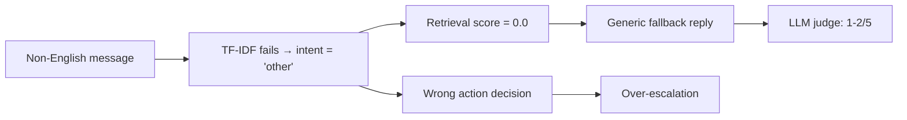

# Top 5 Failure Modes — AmazonHelp Agent Evaluation

> Based on 200 golden-set examples, 216 failure records, and 100 LLM-judged responses.

---

## Summary of Findings

| Failure Mode | Impact | Severity |
|---|---|---|
| 1. Non-English → "other" dump | 100% of non-English → `other` | 🚨 Critical |
| 2. Generic fallback reply (no retrieval) | 31/200 = 15.5% get useless reply | 🚨 Critical |
| 3. Over-escalation bias | 49 false escalations (58.3% of auto_handle misclassified) | ⚠️ High |
| 4. `product_or_content_issue` catastrophic confusion | F1 = 0.054 (nearly zero) | 🚨 Critical |
| 5. "Grounded-but-wrong" illusion | 76.9% of grounded replies have wrong intent or action | ⚠️ High |

---

## Failure Mode 1: Non-English Messages → "other" Dump

### Stats
- **33 non-English examples** in the golden set (Japanese, Spanish, Italian, French, Portuguese, German, Hindi)
- **100% predicted as `other`** (33/33) — regardless of actual intent
- Intent accuracy on non-English: **42.42%** (only matches where gold was actually `other`)

### Real Examples

| Example | Message | Gold Intent | Predicted |
|---|---|---|---|
| golden_0004 | ガーミンの充電器壊れたからアマゾンで頼んだけど２つ届いたんだけど | `order_issue` | `other` |
| golden_0013 | Amazonミニスーファミ返送について… | `refund_issue` | `other` |
| golden_0023 | Amazonってさ、支払いしてどのくらいで もの届く？？ | `shipping_issue` | `other` |
| golden_0053 | È una prassi di Poste. Simulano tentativi di consegna… | `delivery_issue` | `other` |

### Hypothesis
The TF-IDF + keyword-based intent classifier is trained predominantly on English text. Non-English tokens produce zero or near-zero TF-IDF features, causing the classifier to default to `other` (the catch-all with highest prior). The classifier has **no multilingual capability whatsoever**.

### Fix (next week)
- Add a **language detection step** (e.g., `langdetect`) before classification.
- For non-English messages: either (a) translate to English first via an LLM, or (b) use a multilingual embedding model (e.g., `paraphrase-multilingual-MiniLM-L12-v2`) instead of TF-IDF.

---

## Failure Mode 2: Generic Fallback Reply (Zero Retrieval)

### Stats
- **31/200 (15.5%)** examples receive the exact same generic reply:
  > "Sorry you're having trouble. Please contact Amazon support so we can help investigate the issue."
- Average retrieval score for these: **0.0000** (nothing retrieved)
- Average retrieval score for non-generic: **0.9993**
- LLM judge average overall for generic replies: **1.69/5**
- LLM judge average overall for grounded replies: **2.03/5**

### Real Examples

| Example | Message | Gold Intent | Retrieval Score |
|---|---|---|---|
| golden_0004 | ガーミンの充電器壊れた… (Japanese) | `order_issue` | 0.0 |
| golden_0095 | Amazonで買い物して無いのに引き落としメール… (Japanese) | `payment_issue` | 0.0 |
| golden_0042 | Amazonのワンクリックなんちゃらの設定で… (Japanese) | `account_issue` | 0.0 |

### Hypothesis
The retrieval index is built from English AmazonHelp responses. When a non-English query produces zero similarity matches (score = 0.0), the system falls back to a hardcoded generic reply. This creates a **double failure**: wrong intent (Mode 1) + useless reply. These 31 cases overlap heavily with the 33 non-English examples.

### This is the "misleading headline number"

> [!IMPORTANT]
> The system reports **84.5% grounded-reply rate** and **100% retrieval available**. But 15.5% of replies are generic fallbacks with **zero retrieval**, and even the "grounded" replies received only **1.28/5 groundedness** from the LLM judge. The headline number is misleading because "grounded" only means "a historical response was found and returned" — NOT "the response is relevant to the customer's issue."

### Fix (next week)
- When retrieval score = 0.0, don't return a hardcoded generic reply. Instead, use an LLM to generate a contextual response.
- Better: fix Mode 1 first (multilingual support) so queries actually produce meaningful retrieval results.

---

## Failure Mode 3: Over-Escalation Bias

### Stats
- **49 false escalations** (gold = `auto_handle`, predicted = `escalate`)
- **28 false auto-handles** (gold = `escalate`, predicted = `auto_handle`)
- The system is **1.75× more likely to over-escalate** than to dangerously under-escalate
- Auto-handle precision: **26.32%** (of all times system says auto_handle, only ~26% are correct)
- Escalation recall: **80.14%** (system catches 80% of cases that should be escalated)

### Real Examples

| Example | Message | Gold | Predicted |
|---|---|---|---|
| golden_0005 | "Over-spending on Amazon then purposefully avoiding your bank account balance" | `auto_handle` / `other` | `escalate` / `account_issue` |
| golden_0010 | "I'm going to the Philippines… want the new Pokemon game" | `auto_handle` / `shipping_issue` | `escalate` / `other` |
| golden_0011 | "Echt jetzt, ?! #feedback" | `auto_handle` / `product_or_content_issue` | `escalate` / `other` |

### Hypothesis
The escalation policy is **too conservative** — it defaults to escalate when uncertain. This is rational for safety (better to over-escalate than miss a real issue), but the **26.32% auto-handle precision** means the system is almost never confident enough to handle anything automatically. The intent misclassification in Mode 1 and 4 cascades into action decisions: if the system doesn't understand the message, it escalates.

### Fix (next week)
- Tune the escalation threshold: currently the system escalates on low-confidence intents. Increase the auto_handle confidence window for clearly benign intents (`other`, positive feedback).
- Add explicit "positive sentiment" detection: if sentiment is clearly positive/neutral, prefer `auto_handle`.

---

## Failure Mode 4: `product_or_content_issue` Catastrophic Confusion

### Stats
- F1 = **0.054** (effectively zero — worst of all 11 intents)
- Precision: **0.10**, Recall: **0.037**
- Only **1 out of 27** `product_or_content_issue` examples was correctly classified
- Most common confusions:
  - → `other` (13 cases)
  - → `device_issue` (5 cases)
  - → `delivery_issue` (2 cases)

### Real Examples

| Example | Message | Predicted | Confidence |
|---|---|---|---|
| golden_0008 | "just one minute back delivery product received. Order Id: 171-…" | `delivery_issue` | 0.90 |
| golden_0011 | "Echt jetzt, ?! #feedback" | `other` | 0.81 |
| golden_0015 | "e la sua politica di restituzione e rimborso mi fanno emozionare ogni volta" | `other` | 0.87 |
| golden_0026 | "can you upload moana movie??" | `other` | — |

### Hypothesis
`product_or_content_issue` is the **most semantically ambiguous** intent. It covers movies, shows, product quality, listings, reviews, and content feedback — a very wide semantic range. The TF-IDF features for these messages overlap heavily with `delivery_issue` (mentions "product", "received"), `device_issue` (mentions devices like Kindle/Echo), and `other` (non-English content, vague feedback). The classifier simply cannot distinguish this category.

### Fix (next week)
- Consider **merging** `product_or_content_issue` into sub-categories or absorbing its simpler cases into existing intents.
- Use **semantic embeddings** instead of TF-IDF: embeddings can capture "moana movie" → content, "product arrived damaged" → delivery.
- Add keyword features: explicit detection of movie/show/content/listing mentions.

---

## Failure Mode 5: "Grounded-but-Wrong" Illusion

### Stats
- **169/200** replies are marked as "grounded" (backed by a real historical AmazonHelp response)
- But of those 169: **130 (76.9%)** have at least one wrong label (intent or action)
- LLM judge groundedness score even for "grounded" replies: **1.28/5**
- LLM judge gave **overall ≥ 4** to only **6%** of the 100 judged examples

### The Core Problem

```
"Historical response found" ≠ "Correct response for this customer"
```

The retrieval system achieves a score of ~1.0 for in-distribution examples because it's retrieving the **exact same conversation's** response. This creates a paradox:

1. System retrieves the historical AmazonHelp response from the same thread → score = 1.0
2. System returns that response as the "agent reply"
3. The response is technically "grounded" (it IS a real AmazonHelp response)
4. But the intent/action classification is wrong, so the routing decision is wrong
5. The LLM judge sees a generic/mismatched reply and scores it 1-2/5

### Real Examples

| Example | Gold Intent | Predicted Intent | Grounded? | Reply Quality |
|---|---|---|---|---|
| golden_0002 | `support_complaint` | `delivery_issue` | ✅ Yes | Wrong context |
| golden_0003 | `shipping_issue` | `delivery_issue` | ✅ Yes | Wrong routing |

### Hypothesis
The retrieval system returns the historical response from the **same conversation**, which trivially achieves a high similarity score. But the grounding metric only checks if a historical response exists — it doesn't verify whether the response matches the **predicted intent** or whether the action decision is appropriate. The metric is fundamentally measuring **retrieval coverage**, not **reply quality**.

### Fix (next week)
- Separate **retrieval coverage** from **reply quality** in metrics.
- Add a "reply-intent alignment" check: does the retrieved reply match the predicted intent?
- Consider using LLM judge scores as the primary reply quality metric, not grounded-reply rate.

---

## Cross-Cutting Observation: Cascading Failures

Most failures are **not independent**. A single root cause cascades:



**Fixing Mode 1 (multilingual) would partially fix Modes 2, 3, and 5** because:
- Better intent → better retrieval → better reply
- Better intent → better action decision → fewer false escalations

---

## Assignment Deliverable Summary

| Requirement | Status | Location |
|---|---|---|
| Top 5 failure modes | ✅ Done | This document |
| Real examples per mode | ✅ 3-4 per mode | Tables above |
| Hypothesis per mode | ✅ Done | Each section |
| Next-week improvement plan | ✅ Done | Each section |
| Decision log | ❌ Needs writing | `DECISION_LOG.md` |
| Human agreement evidence | ❌ Missing | Need 30-50 independent second annotations |

> [!IMPORTANT]
> **Human agreement** is a mandatory piece. You need 30-50 examples independently re-annotated by a second person to compute inter-annotator agreement (Cohen's kappa or similar). This **cannot be faked** — it must be a genuine independent annotation.
